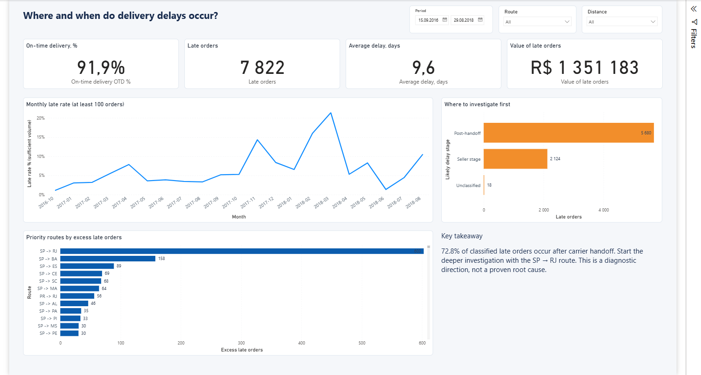
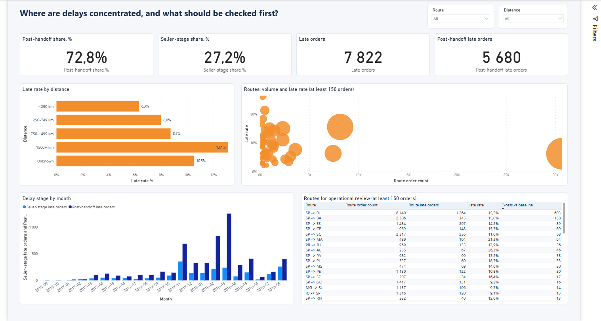
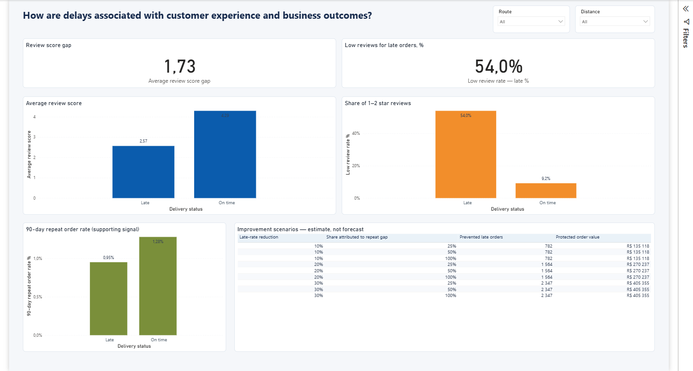

# Olist Delivery Performance Analysis

## Executive summary

- **Late deliveries affected 8.1% of eligible orders:** 7,822 of 96,281 deliveries arrived after the promised date.
- **The largest diagnostic signal appears after carrier handoff:** 72.8% of classified late orders had been handed over on time. This identifies where to investigate next, but does not prove carrier responsibility.
- **The first operational priority is the `SP -> RJ` route:** it produced about 603 more late orders than expected at the overall baseline rate.

## Business question

Which delivery stages, routes, and seller groups should be prioritized to reduce late deliveries without increasing freight intensity or excluding difficult regions?

## Analysis walkthrough

The calculations are available in [`sql/02_analysis_queries.sql`](sql/02_analysis_queries.sql), and the full analytical flow is shown in [`notebooks/analysis.ipynb`](notebooks/analysis.ipynb).

### 1. How large is the delivery problem?

**Question.** What share of orders arrived after the promised delivery date?

**Method.** The analysis uses one row per delivered order and excludes records with missing or chronologically invalid delivery dates. An order is late when its actual delivery date is later than its estimated delivery date.

**Result.** 7,822 of 96,281 eligible orders were late, producing an 8.1% late-delivery rate and a 91.9% on-time delivery rate.

**Interpretation.** The issue is large enough to justify an operational pilot, but the aggregate rate does not show where intervention is needed.

<details>
<summary>SQL used</summary>

```sql
SELECT
    COUNT(*) AS eligible_orders,
    SUM(late_flag) AS late_orders,
    1.0 - AVG(late_flag) AS on_time_rate,
    AVG(late_flag) AS late_rate,
    AVG(CASE WHEN late_flag = 1 THEN days_vs_promise END) AS avg_late_days
FROM fact_order_analysis
WHERE analysis_eligible = 1;
```

</details>

### 2. When did performance deteriorate?

**Question.** Are delays stable over time, or concentrated in specific periods?

**Method.** Monthly late-delivery rates were compared with order volume. Peak months were then decomposed by distance band to test whether the increase was caused only by a larger share of long-distance orders.

**Result.** The largest spikes occurred in November 2017 and February–March 2018. The deterioration remained visible within distance bands.

**Interpretation.** Distance mix alone does not explain the spikes. A temporary capacity, routing, or service-level issue is more plausible, but the dataset does not contain the operational events needed to identify it.

<details>
<summary>SQL used</summary>

```sql
SELECT
    substr(order_purchase_timestamp, 1, 7) AS purchase_month,
    COUNT(*) AS orders,
    SUM(late_flag) AS late_orders,
    AVG(late_flag) AS late_rate,
    AVG(days_vs_promise) AS avg_days_vs_promise
FROM fact_order_analysis
WHERE analysis_eligible = 1
  AND order_purchase_timestamp >= '2017-01-01'
  AND order_purchase_timestamp < '2018-08-01'
GROUP BY substr(order_purchase_timestamp, 1, 7)
ORDER BY purchase_month;
```

</details>



### 3. At which delivery stage should the investigation begin?

**Question.** Were late orders already delayed before carrier handoff, or did they become late afterward?

**Method.** For single-seller orders, the actual carrier handoff date was compared with the seller shipping deadline. Multi-seller orders were left unclassified because one order-level handoff date cannot be assigned reliably to several sellers.

**Result.** Among classified late orders, 27.2% involved a late seller handoff and 72.8% were handed to the carrier on time.

**Interpretation.** The post-handoff stage is the main direction for further investigation. This is a diagnostic classification, not evidence that a particular carrier caused the delay.

<details>
<summary>SQL used</summary>

```sql
SELECT
    CASE
        WHEN late_flag = 0 THEN 'on_time'
        WHEN seller_count <> 1 THEN 'late_unclassified_multi_seller'
        WHEN seller_handoff_after_limit_flag = 1
            THEN 'late_seller_stage_involved'
        ELSE 'late_downstream_candidate'
    END AS stage_bucket,
    COUNT(*) AS orders,
    AVG(seller_stage_days) AS avg_seller_stage_days,
    AVG(carrier_stage_days) AS avg_carrier_stage_days
FROM fact_order_analysis
WHERE analysis_eligible = 1
GROUP BY stage_bucket
ORDER BY orders DESC;
```

</details>

### 4. Where are excess delays concentrated?

**Question.** Which routes and sellers combine meaningful volume with worse-than-baseline performance?

**Method.** Segments were ranked by excess late orders: observed late orders minus the number expected at the overall late-delivery rate. This prevents small segments with extreme percentages from dominating the priority list.

**Result.** The `SP -> RJ` route was the leading priority, with approximately 603 excess late orders.

**Interpretation.** The first pilot should focus on high-volume routes and sellers that contribute the largest avoidable volume, rather than simply selecting the highest late-delivery percentage.

<details>
<summary>SQL used</summary>

```sql
WITH baseline AS (
    SELECT AVG(late_flag) AS baseline_late_rate
    FROM fact_order_analysis
    WHERE analysis_eligible = 1
), route_performance AS (
    SELECT
        CONCAT(seller_state, ' -> ', customer_state) AS route,
        COUNT(*) AS orders,
        SUM(late_flag) AS late_orders,
        AVG(late_flag) AS late_rate
    FROM fact_order_analysis
    WHERE analysis_eligible = 1
      AND seller_state IS NOT NULL
      AND customer_state IS NOT NULL
    GROUP BY seller_state, customer_state
)
SELECT
    route_performance.*,
    MAX(
        0,
        late_orders - orders * baseline_late_rate
    ) AS excess_late_orders
FROM route_performance
CROSS JOIN baseline
WHERE orders >= 150
ORDER BY excess_late_orders DESC, orders DESC;
```

</details>



### 5. How are delays associated with customer outcomes?

**Question.** Do late deliveries coincide with worse reviews or fewer repeat purchases?

**Method.** Review scores and 90-day repeat-purchase rates were compared between on-time and late orders. The direction of each difference was also checked across distance bands.

**Result.** Late orders had an average review score 1.73 points below on-time orders. The repeat-purchase difference was only 0.3 percentage points and was inconsistent across distance bands.

**Interpretation.** Review score is a strong and consistent business signal. Repeat purchase is supporting evidence only and should not be presented as a proven financial effect.

<details>
<summary>SQL used</summary>

```sql
SELECT
    CASE WHEN late_flag = 1 THEN 'late' ELSE 'on_time' END AS delivery_group,
    COUNT(review_score) AS reviewed_orders,
    AVG(review_score) AS avg_review_score,
    AVG(CASE WHEN review_score <= 2 THEN 1.0 ELSE 0.0 END) AS low_review_rate
FROM fact_order_analysis
WHERE analysis_eligible = 1
  AND review_score IS NOT NULL
GROUP BY late_flag;

SELECT
    CASE WHEN late_flag = 1 THEN 'late' ELSE 'on_time' END AS delivery_group,
    COUNT(*) AS eligible_orders,
    AVG(repeat_90d_flag) AS repeat_90d_rate
FROM fact_order_analysis
WHERE analysis_eligible = 1
  AND repeat_90d_eligible = 1
GROUP BY late_flag;
```

</details>



## Recommendation

Run a focused pilot on high-volume routes and sellers with the most excess late orders:

1. Track on-time delivery as the primary outcome.
2. Monitor seller handoff compliance and post-handoff duration as diagnostics.
3. Use freight intensity and review score as guardrails.
4. Target at least a 20% relative reduction in the late-delivery rate.

Carrier identifiers and detailed logistics events are required before assigning a root cause within the post-handoff stage.

## Data and tools

- Dataset: [Brazilian E-Commerce Public Dataset by Olist](https://www.kaggle.com/datasets/olistbr/brazilian-ecommerce)
- Coverage: approximately 100,000 anonymized orders from 2016 to 2018
- License: [CC BY-NC-SA 4.0](https://creativecommons.org/licenses/by-nc-sa/4.0/)
- Tools: SQL, Python, Jupyter, Power BI, Power Query, and DAX

Prepared Power BI tables are included in `data/powerbi`. Original source files are available from the dataset page.

## Project structure

```text
data/powerbi/          Prepared dashboard data
notebooks/             Analysis and validation checks
powerbi/project/       Power BI project
powerbi/screenshots/   Dashboard previews
scripts/               Data preparation and analysis
sql/                   Data model and analytical queries
```

## Run locally

1. Download the original Olist CSV files into `data/raw/olist`.
2. Install dependencies: `pip install -r requirements.txt`.
3. Run:

```powershell
python scripts/build_database.py
python scripts/run_analysis.py
python scripts/build_powerbi_assets.py
```

4. Open `powerbi/project/SupplyChainOlist.pbip` in Power BI Desktop.
5. Set the `DataFolder` parameter to the absolute path of `data/powerbi`, then refresh.

## Limitations

- The dataset has no carrier IDs, sorting-centre events, compensation costs, or return costs.
- Seller-stage classification is limited to single-seller orders.
- Customer-impact comparisons are observational and do not establish causality.
- Historical results from 2016–2018 are not a current operational benchmark.
